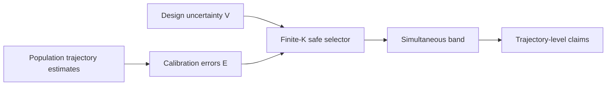

# The Wrong Unit of Uncertainty


Replication package for *"The Wrong Unit of Uncertainty: Simultaneous Inference
for Repeated Cross-National Surveys"* (Kunwoo Park, Kookmin University;
in preparation for submission to *Political Analysis*).

## What this is

Claims about repeated cross-national surveys attach uncertainty to the wrong unit
twice: a wave-pair mean contrast stands in for a persistent, distribution-wide
trajectory, and an estimated distribution stands in for the latent one it samples.
This package provides:

- **within a country**, a **design-based simultaneous band** over the whole
  response-distribution trajectory — a studentized sup-*t* band on wave-pair CDF
  differences from the stratified-PSU bootstrap, so an **asymptotic** guarantee —
  carrying a partially ordered claim family (pairwise, any-pair, net, persistent
  — persistent at the top);
- **across countries**, a **finite-sample clustered conformal band**, with the
  country as the exchangeable unit, plus a Bonferroni layer and a closed-testing
  lower bound on the across-country count;
- a **non-identification theorem and survey-scale unreachability boundary** for
  the design-aware (deconvolution) correction, with a provably selection-free
  deployed selector;
- two named reanalyses — **ESS parliamentary trust** (2002–2024) and the
  **WVS Foa–Mounk deconsolidation battery** (WVS Trend File, 1981–2022) — plus V-Dem
  cross-tabs and a same-items comparison with the Claassen latent panel.

## Headline results (all regenerate from `results/*.csv`)

| finding | where |
|---|---|
| Marginal readings flag 20/30 ESS countries; the hierarchy certifies net decline in 6, persistence in 1 (Greece) | `e13`, §7 |
| Over the full 2002–2024 record, read off one joint band: persistence in **0/33**, span erosion in **8**, and 23/33 certifying both a decline and a recovery at one α | `e50`, §7 |
| Closed testing across countries: with 90% simultaneous confidence **at least 6 of 33** truly declined over their span, on each outcome — the across-country count itself now carries a guarantee | `e56`, §7 |
| WVS: persistence cuts the wave-pair set 2.6–6.5×; 12 of the 13 descriptive multi-item core countries pass a valid ≥2-item partial-conjunction test (10/9 at design effects 1.5/2.0) | `e26`/`e63`/`e65`, §7 |
| Deconvolution is non-identified without the design-noise law and unreachable at survey scale (K≥94 floor) | Thm 1, Prop 2, §2/§6 |
| Robustness: RWY-rescaled bootstrap, WVS and joint-band design-effect sweeps, mode audit from the data's own mode variable, LORO exchangeability, null-imposed severity injection, window-matched Claassen — plus two **withdrawn** results with published diagnoses | `e38`–`e53`, Supplement |

## Quickstart

```bash
pip install -r requirements.txt && pip install -e .
python -m pytest tests/ -q          # contracts + claim ledger
python -m pcb.experiments.e28_wrong_unit_coverage   # Table 1, ~seconds
```

Using the method on your own data — Python:

```python
from pcb import dapcb
fit = dapcb(cal_errors, v_cal, center, alpha=0.10)
fit.band, fit.selected_branch, fit.coverage_level, fit.target, fit.fallback_reason
```

or R (`rpkg/dapcb`, a pure-R port validated against the Python reference by
golden tests to 1e-10; `R CMD check` passes with no ERROR — building the
vignette additionally needs `rmarkdown`):

```r
install.packages("rpkg/dapcb", repos = NULL, type = "source")
library(dapcb)
E <- as.matrix(read.csv("calibration_errors.csv", check.names = FALSE))
V <- as.matrix(read.csv("design_sds.csv", check.names = FALSE))
mu <- scan("target_center.csv", quiet = TRUE)
fit <- dapcb(E, V, mu, alpha = 0.10)
fit$selected_branch
fit$coverage_level
fit$target
fit$fallback_reason
cbind(lower = fit$lo, center = mu, upper = fit$hi)
```

`E` and `V` are matching `K × T` matrices: one row per exchangeable
population and one column per stacked trajectory coordinate. `mu` is the
length-`T` target center. The returned level always states which target it
covers; if a gate blocks deconvolution, `fallback_reason` says why.



## Reproduce

**Start at [REPLICATION.md](REPLICATION.md)** — the replication analyst's
entry point: environment, run order, runtimes, and the claim→artifact→test map
([docs/REPLICATION_MAP.md](docs/REPLICATION_MAP.md)). `make deposit` builds
the curated, deterministic submission archive. Two tiers
(details in [docs/REPRODUCIBILITY.md](docs/REPRODUCIBILITY.md)):

- **Tier 1 (no microdata)**: all simulation/theory/benchmark experiments and the
  V-Dem/Claassen public-data analyses run out of the box.
- **Tier 2 (licensed microdata)**: the ESS/WVS/LAPOP reanalyses. Exact files,
  registration links, placement paths, and sha256 checksums are in
  **[docs/DATA_SOURCES.md](docs/DATA_SOURCES.md)**; the ESS inputs (integrated
  files and all SDDF files) can also be fetched by script through the ESS
  Data Portal API with a registered user ID (`scripts/fetch_ess_api.py`,
  `scripts/fetch_ess_sddf.py`, `scripts/build_ess_subset.py`). The ESS
  certification, the WVS hierarchy, and the joint claim family reproduce the
  committed CSVs **bit-identically** (verified in independent environments,
  including from the API-built subset).

All runs use fixed seeds (`pcb.util.det_seed`) and are deterministic.
Shell entry points: `setup.sh`, `run_public.sh` (Tier 1), `run_restricted.sh`
(Tier 2, checks the licensed inputs first), `run_all.sh`. Fine-grained
targets: `make test`, `make tier1`, `make tier2`, `make figures`, `make paper`.

## Layout

```
paper/            LaTeX source + compiled PDFs (main, supplement, title page)
rpkg/dapcb/        R package: pure-R dapcb port, vignette, golden cross-language tests
pcb/
  inference/      clustered/population conformal, design_aware, safe selector
  data/           survey loaders: ESS, WVS trend file, LAPOP (schema audits)
  simulation/ theory/     generators and theory checks
  experiments/    e6–e65 (simulation arc, ESS/LAPOP/WVS, robustness, frontier,
                  prevalence; e43–e49, e51 superseded/withdrawn — see supplement)
  figures/        figure generators (write to figures/; tracked copies in paper/figures/)
tests/            contract tests (theorem<->code) plus a claim ledger pinning
                  every headline number in the paper to the CSV that licenses it
results/          precomputed result tables (CSV) — every paper number lives here
docs/             preregistrations, results write-ups, proofs, data sources, HANDOFF
configs/          frozen validation manifests (seeds, script hashes)
```

## Data notice

`/data/` is gitignored: the ESS, WVS, and LAPOP microdata are licensed by
their providers and never committed. Download each from its provider and place
per `docs/DATA_SOURCES.md`. Everything else — code, results, paper — is
MIT-licensed (see `LICENSE`); the licensed survey data are **not** covered by
that license.

## Citation

See [`CITATION.cff`](CITATION.cff). Until the paper is published, cite the
package by its title and this repository.
